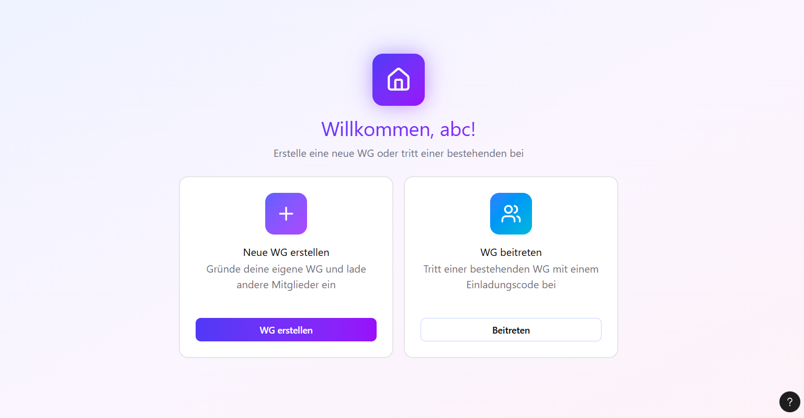
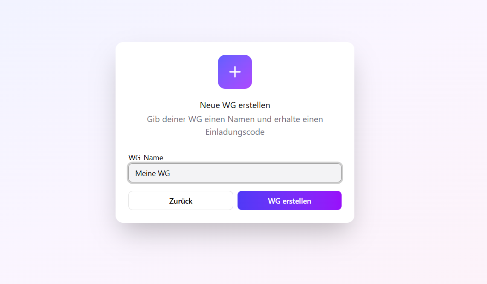
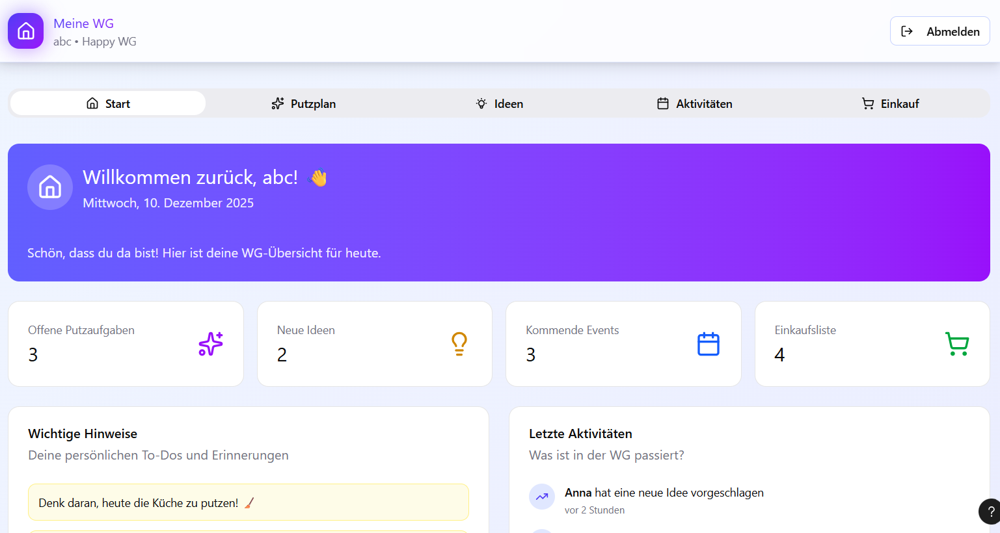
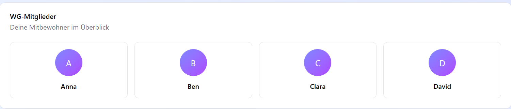
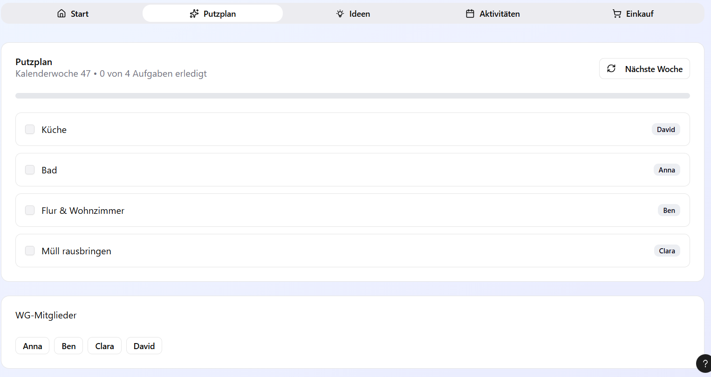
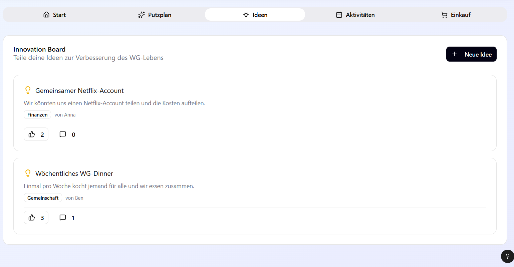
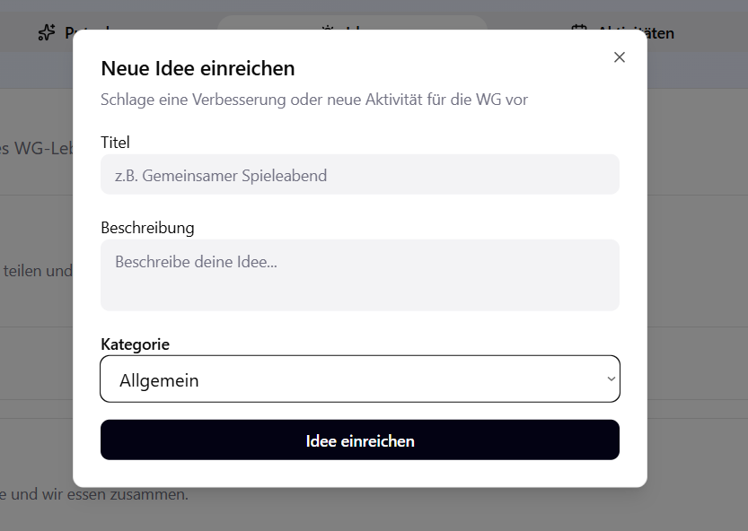
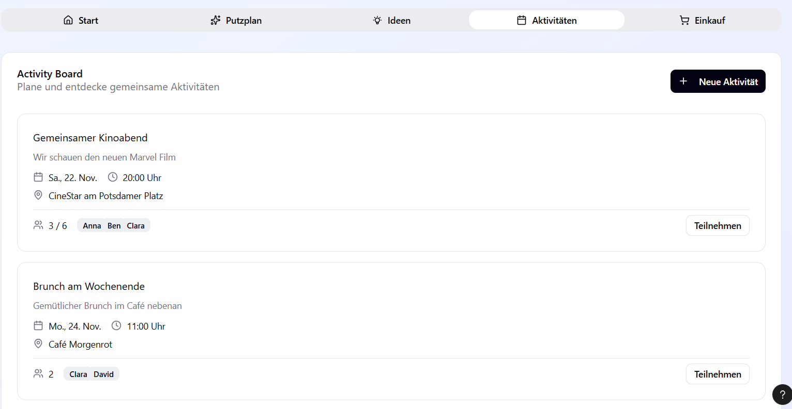
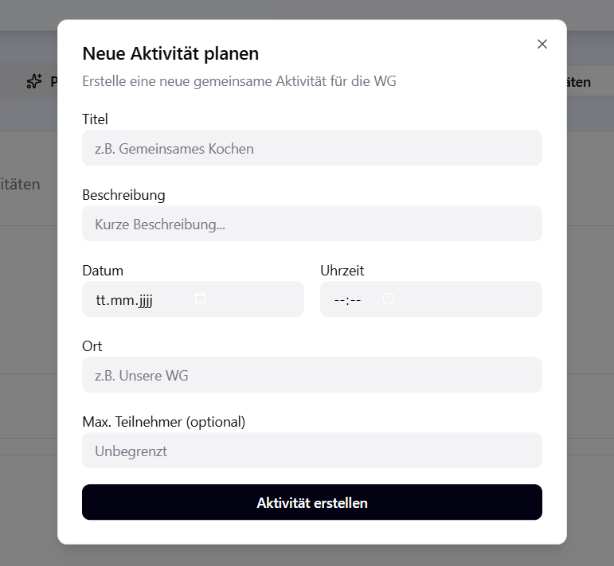
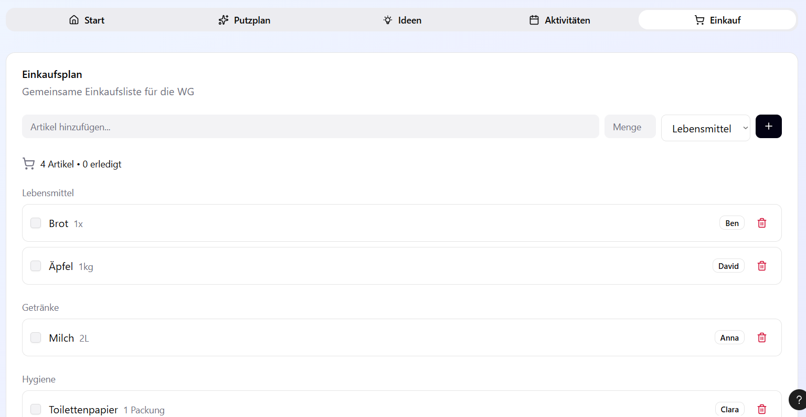

# **Design**
Siehe Data Model für Beziehungen (*kursiv Gedrucktes*).

**So sieht unser aktuelles Figma-Design aus:**

# Login

Mit dem Login kann man sich einen Account erstellen oder einloggen. Man muss einen Namen eingeben (*username*), eine Email (*email*) und passwort (*password_hash*)

# WG erstellen oder beitreten

Man hat die Wahl zwischen WG erstellen und einer WG beitreten.

Hier kann man eine WG erstellen mit einem custom Namen. Es wird eine WG in der Datenbank generiert (mit *wg_id* und *created_at*).

# Das Dashboard

Auf dem Dashboard sieht man den WG-Namen und man bekommt eine Greeting-Message mit Namen, Datum und Kommentar. Man sieht auch die einzelnen Reiter (z.B. Putzplan etc., die man auswählen kann). 
Man sieht Widgets mit Icons, die mit den einzelnen Funktionen verbunden sind (z.B. Offene Putzaufgaben).
Dazu sieht man auch Widgets mit "Wichtigen Hinweisen" und "Letzten Aktivitäten".
Ganz unten sieht man noch die WG-Mitglieder (*wg_members*)

# Putzplan

Im Putzplan kann man ganz einfach nach Kalenderwoche (*calendar_week*) Aufgaben (*CLEANING_TASKS*) verteilen (geschieht automatisiert). Dazu sieht man auch den Namen der Person, für die die Aufgabe gilt.
Man kann die Checkbox abhaken, während sich ein grüner Balken füllt (je nach Vollständigkeit der Erledigungen).

# Innovation Board

Man wird eingeladen, Ideen für die WG zu teilen. Neue Ideen kann man rechts mit dem Button "Neue Idee" erstellen. Unten aufgelistet, findet man alle hinzugefügten Ideen.
Die Ideen haben einen Like-Counter und Kommentarfunktion.

# Activity Board

Hier kann man Aktivitäten mit der WG planen. Wie beim Innovation Board hat man hier alle Aktivitäten auf einen Blick. Rechts oben kann man mit dem "Neue Aktivität"-Button eine neue Aktivität hinzufügen. Mit dem Button "Teilnehmen" kann man sich für eine Aktivität einschreiben.

# Einkaufsplan

Mit dem Einkaufplan kann man sehen, wer welchen Einkauf zu erledigen hat. Wenn der Einkauf getätigt wurde, kann man ihn als "erledigt" deklarieren. Man kann ein neuen Artikel hinzufügen, indem man den Namen (*SHOPPING_ITEM*, *name*)  und die Menge (*quantity*) eingibt, die Kategorie (*SHOPPING_CATEGORY*) wählt und auf den schwarzen "+" Button klickt.

{: .fs-2 }
Last build: {{ site.time | date: '%d %b %Y, %R%:z' }}