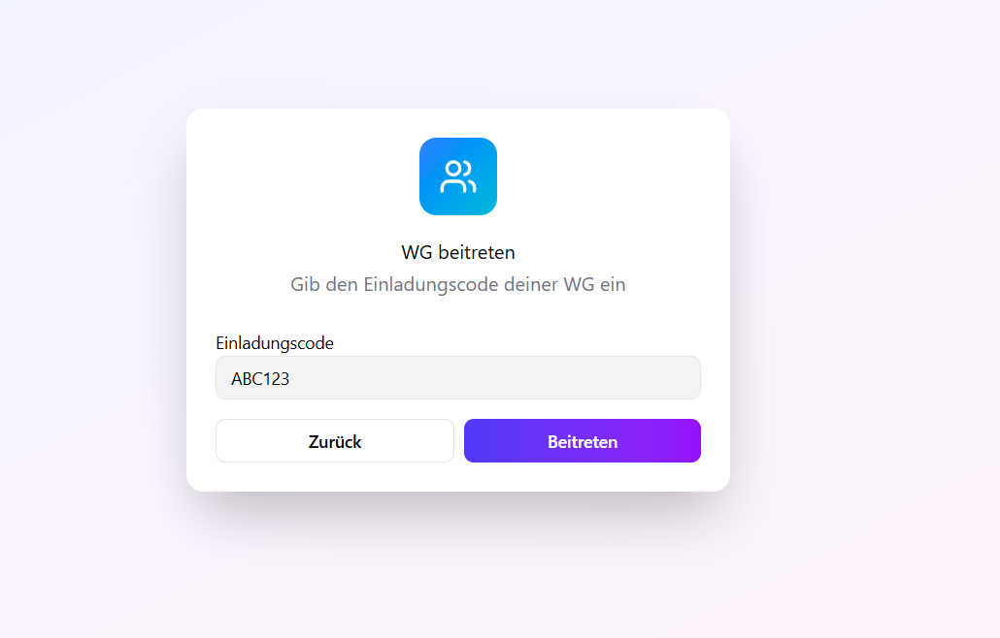

## WG Dashboard

**So sieht unser aktuelles Figma-Design aus:**

# Login

# WG erstellen oder beitreten

# Das Dashboard

Dies ist unser Dashboard. Man sieht oben 

# Putzplan

# Innovation Board

[Innoboard](assets/images/innovationboard.png)

# Activity Board

[Activityboard](assets/images/activityboard.png)

# Einkaufsplan

[Einkaufsplan](assets/images/einkaufsplan.png)

{: .fs-2 }
Last build: {{ site.time | date: '%d %b %Y, %R%:z' }}