# Reference Documentation

---

Diese Seite sammelt die wichtigsten internen Funktionen und Routen der Flask-Webanwendung HappyWG.

{: .text-delta }

Inhaltsverzeichnis

+ ToC
{: toc }

---

## Interne Hilfsfunktionen

---

### `current_user()`

**Route:** keine (interne Funktion)

**Methods:** -

**Purpose:** Ermittelt den aktuell eingeloggten Benutzer anhand der user_id aus der Session. Wird verwendet, um im Backend auf den aktuellen User zuzugreifen, ohne den Session-Code zu wiederholen.

**Sample output:** User-Objekt oder None, falls kein Nutzer eingeloggt ist.

---

### `generate_unique_code(length=6)`

**Route:** keine (interne Funktion)

**Methods:** -

**Purpose:** Generiert einen zufälligen Einladungscode für eine WG. Stellt sicher, dass der Code eindeutig ist, indem überprüft wird, ob er bereits in der Datenbank existiert.

**Sample output:** String (z.B. A9F3KQ)

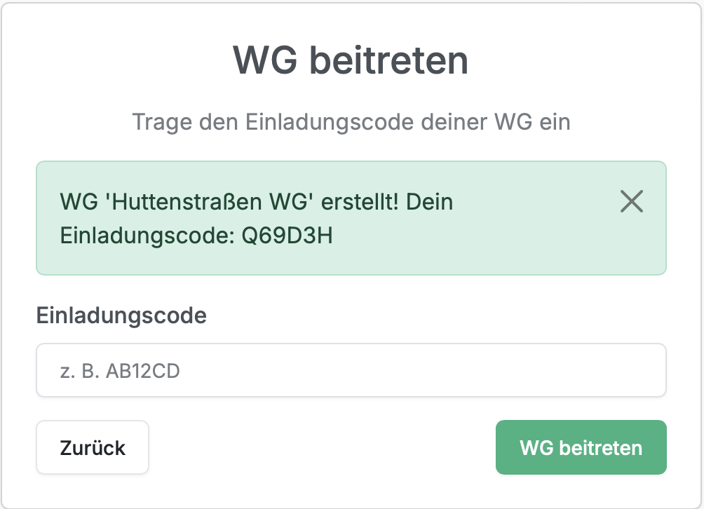

---

### `login_required(f)`

**Route:** keine (Decorator)

**Methods:** -

**Purpose:** Decorator-Funktion zum Schutz von Routen.
Stellt sicher, dass nur eingeloggte Nutzer auf bestimmte Seiten zugreifen können. Falls kein Nutzer eingeloggt ist, erfolgt eine Weiterleitung zur Login-Seite.

**Sample output:** Weiterleitung zu Login-Seite oder Ausführung der geschützten Route.

---

## Routen

---

### `login()`

**Route:** `/login/`

**Methods:** `GET`, `POST`

**Purpose:** Authentifiziert einen Benutzer mithilfe von Benutzername und Passwort.
Überprüft die Zugangsdaten gegen die Datenbank und erstellt bei Erfolg eine User-Session.

**Sample output:** Erfolgreicher Login -> Weiterleitung zur Willkommensseite. 
Fehler -> Anzeige einer Fehlermeldung in der Login-Seite.

    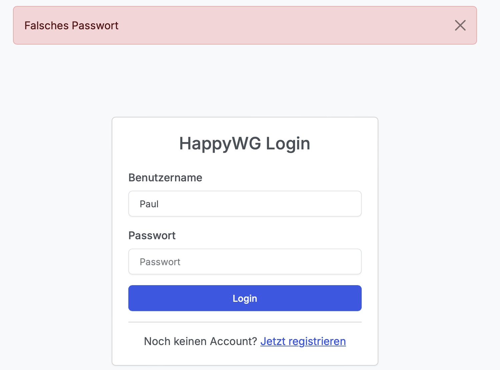
    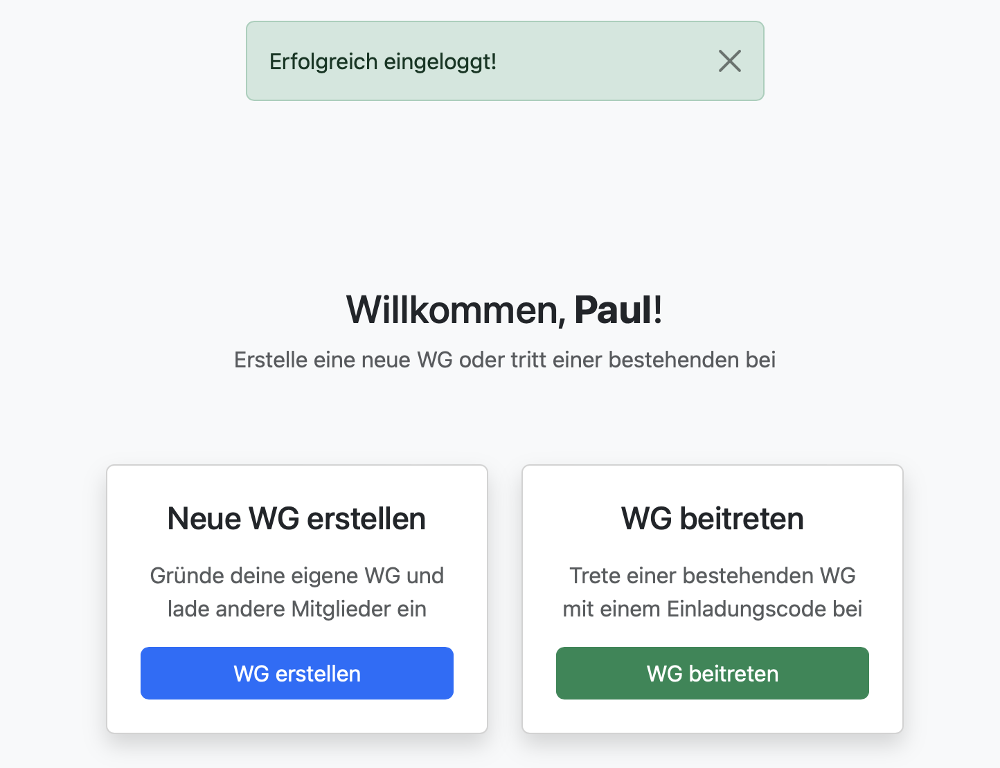

---

### `logout()`

**Route:** `/logout/`

**Methods:** `GET`

**Purpose:** Meldet den Benutzer ab indem die aktuelle Session gelöscht wird.

**Sample output:** Weiterleitung zur Login-Seite.

---

### `register()`

**Route:** `/register/`

**Methods:** `GET`, `POST`

**Purpose:** Registriert einen neuen Benutzer. Das Passwort wird gehasht in der Datenbank gespeichert. Nach erfolgreicher Registrierung wird der Benutzer automatisch eingeloggt. Wenn der Nutzer bereits existiert oder Passwörter nicht übereinstimmen bekommt er eine Fehlermeldung.

**Sample output:** 

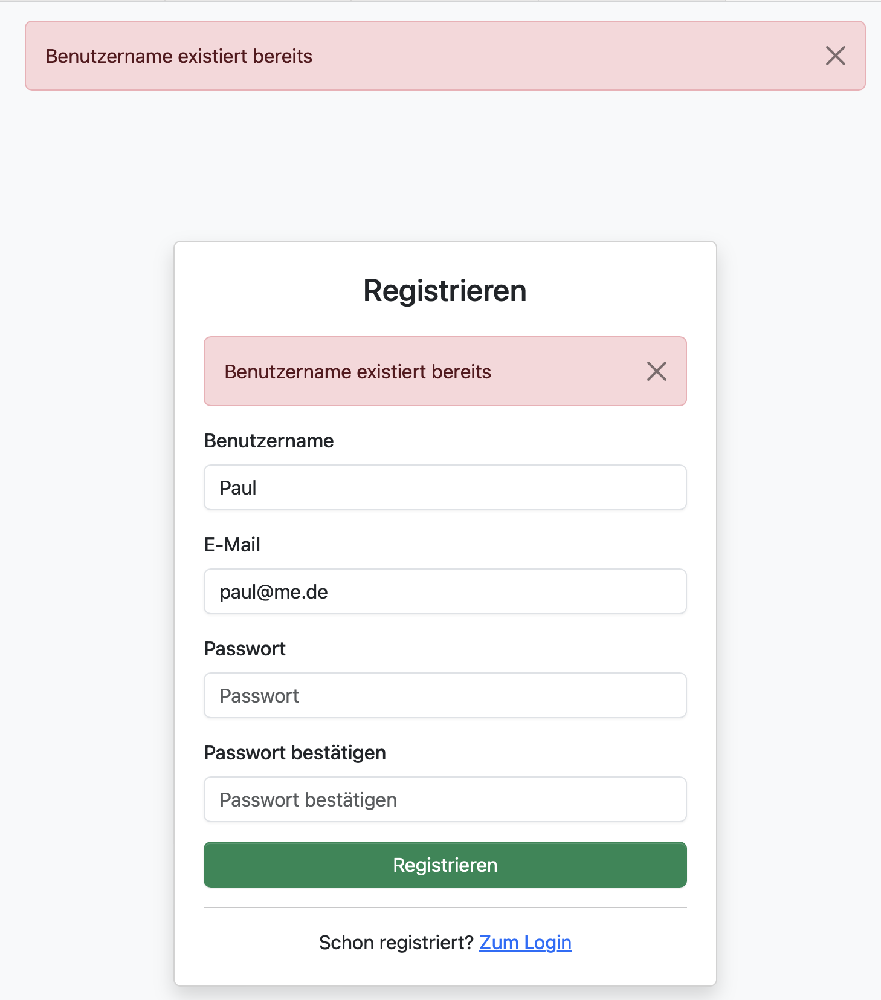

---

### `create_or_join_wg()`

**Route:** `/welcome/`

**Methods:** `GET`, `POST`

**Purpose:** Willkommensseite nach dem Login. Zeigt Option zum Erstellen oder Beitreten einer WG an. Zugriff nur für eingeloggt Nutzer erlaubt.

**Sample output:** 

---

### `create_wg()`

**Route:** `/welcome/create_wg/`

**Methods:** `GET`, `POST`

**Purpose:** Erstellt eine neue WG mit Namen und eindeutigem Einladungscode. Der Einladungscode kann später von anderen Nutzern verwendet werden, um der WG beizutreten.

**Sample output:** Erfolgsmeldung mit Einladungscode und Weiterleitung zur Join-Seite.

---

### `join_wg()`

**Route:** `/welcome/join_wg/`

**Methods:** `GET`, `POST`

**Purpose:** Ermöglicht einem Nutzer, einer bestehenden WG über einen Einladungscode beizutreten. Der Nutzer wird mit der WG in der Datenbank verknüpft.

**Sample output:** Weiterleitung zum Dashboard der WG nach erfolgreichem Beitritt.

---

### `dashboard()`

**Route:** `/dashboard/`

**Methods:** `GET`, `POST`

**Purpose:** Zentrale Übersichtsseite der WG. Zeigt Statistiken, offene Aufgaben, Einkaufsliste, kommende Events, letzte Aktivitäten sowie alle WG-Mitglieder an. Alle Daten werden anhand der wg_id gefiltert, um Mandantentrennungsicherzustellen.

**Sample output:** 

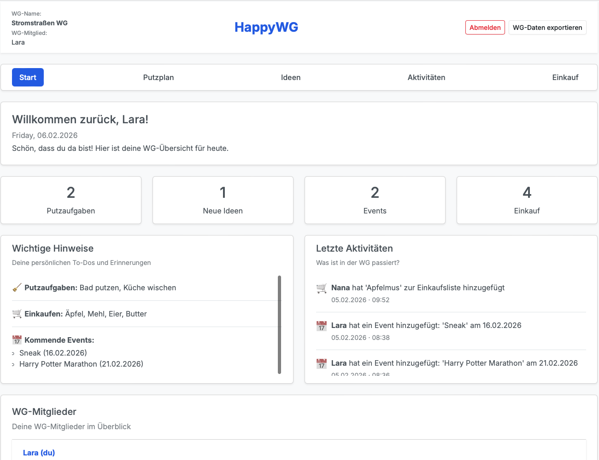

---

### `putzplan()`

**Route:** `/putzplan/`

**Methods:** `GET`, `POST`

**Purpose:** Zeigt den Putzplan der WG an und erlaubt das Erstellen neuer Putzaufgaben. Bei einem POST-Request wird eine neue Putzaufgabe inklusive Vorlage (Cleaning-Template) und zugehörigem Task (CleaningTask) erstellt.

**Sample output:** 

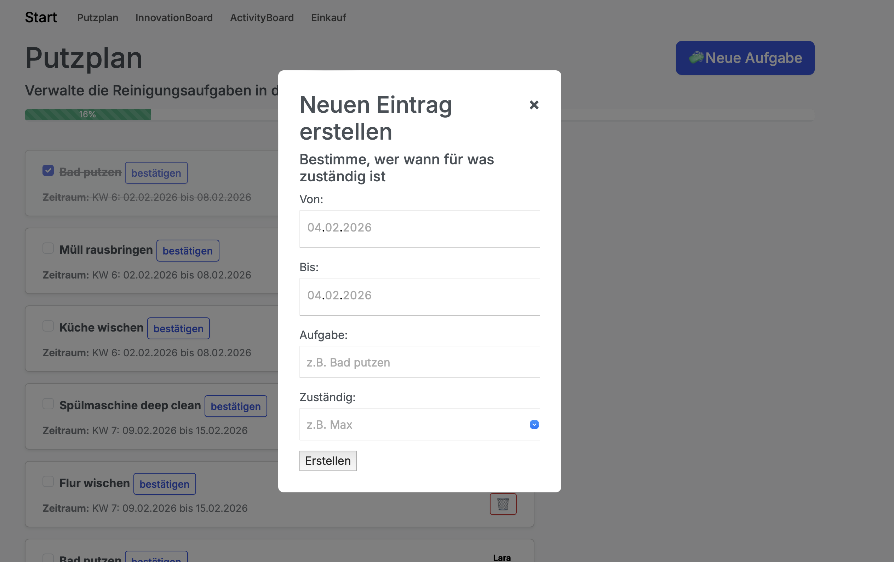

---

### `toggle_cleaning_task(task_id)`

**Route:** `/putzplan/task/<int:task_id>/toggle`

**Methods:** `POST`

**Purpose:** Wechselt den Status einer Putzaufgabe zwischen `open` und `completed`. Beim Abschließen wird zusätzlich das Abschlussdatum gespeichert.

**Sample output:** Kein direkter Output - Statusänderung sichtbar im Putzplant (Checkbox/Fortschrittsbalken).

---

### `delete_cleaning_task(template_id)`

**Route:** `/putzplan/task/<int:template_id>/delete`

**Methods:** `POST`

**Purpose:** Löscht eine Putzaufgabe inklusive ihrer Vorlage. Nur der zuständige Benutzer darf die Aufgabe löschen.

**Sample output:** 

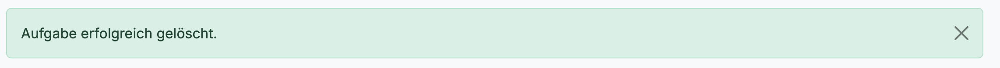

---

### `innovation_board()`

**Route:** `/innovationboard/`

**Methods:** `GET`, `POST`

**Purpose:** Zeigt alle Ideen der WG an und ermöglicht das Erstellen neuer Ideen. Ideen werden farblich dargestellt und dem Ersteller zugeordnet.

**Sample output:** 

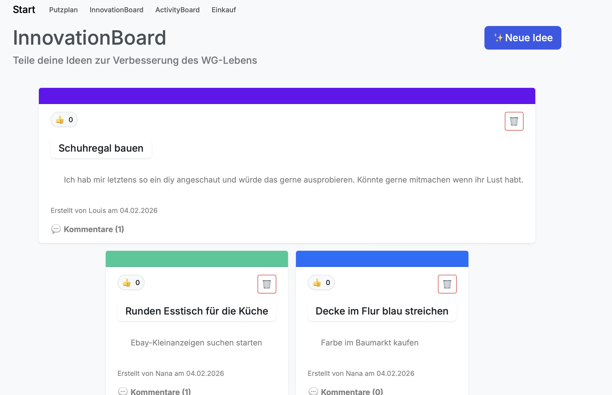

---

### `delete_idea(idea_id)`

**Route:** `/innovation_board/idea/<int:idea_id>/delete`

**Methods:** `POST`

**Purpose:** Löscht eine Idee. Nur der Ersteller der Idee darf diese löschen.

**Sample output:** 

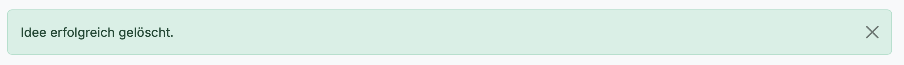

---

### `post_comment(idea_id)`

**Route:** `/ideas/<int:ieda_id>/comment`

**Methods:** `POST`

**Purpose:** Erstellt einen neuen Kommentar zu einer Idee. Leere Kommentare erscheint unter der Idee.

**Sample output:** 

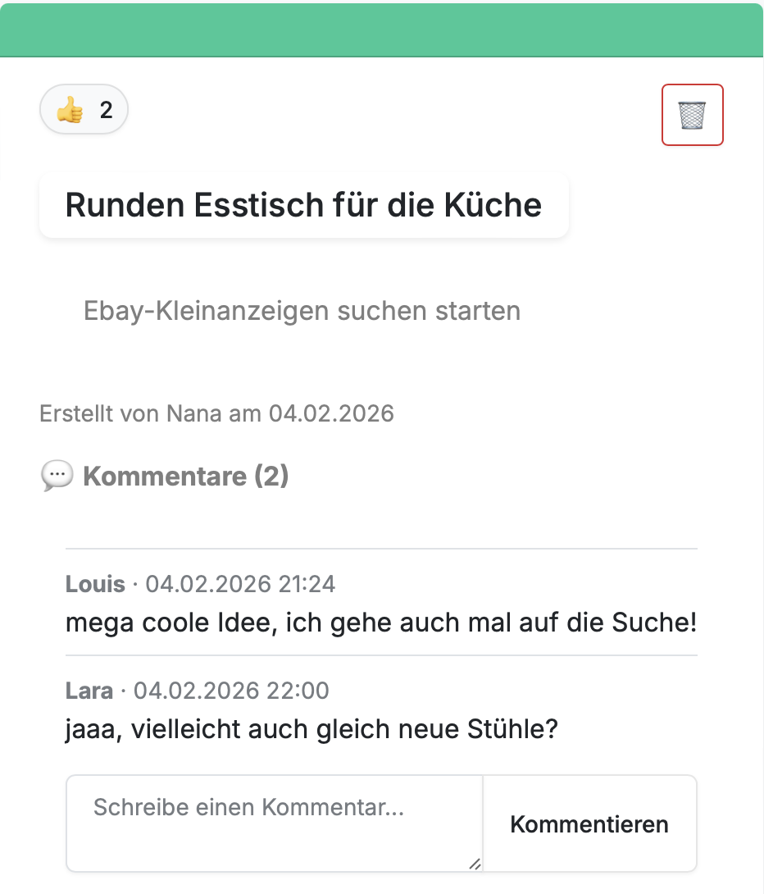

---

### `activity_board()`

**Route:** `/activityboard/`

**Methods:** `GET`, `POST`

**Purpose:** Zeigt alle Aktivitäten der WG an und ermöglicht das Erstellen neuer Aktivitäten (Events). Aktivitäten enthalten Datum, Ort und maximale Teilnahmerzahl.

**Sample output:** 

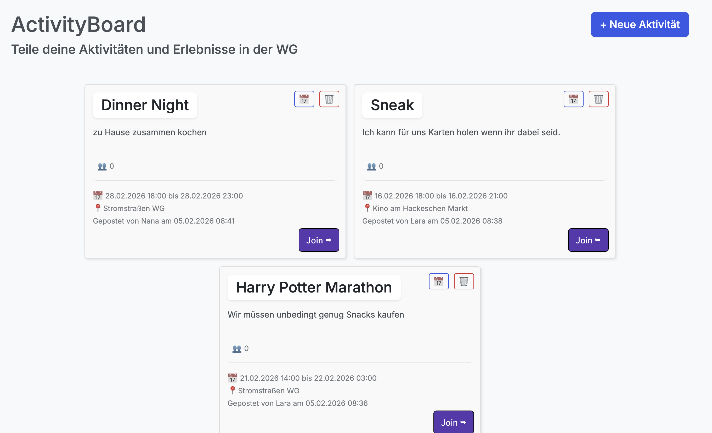

---

### `join_activity(activity_id)`

**Route:** `/activity/<int:activity_id>/join_activity`

**Methods:** `POST`

**Purpose:** Fügt den eingeloggten Benutzer als Teilnehmer einer Aktivität hinzu, sofern noch Plätze frei sind.

**Sample output:** 

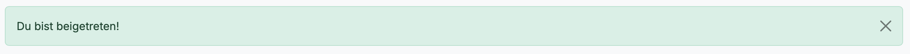

---

### `leave_activity(activity_id)`

**Route:** `/activity/<int:activity_id>/leave_activity`

**Methods:** `POST`

**Purpose:** Entfernt den eingeloggten Benutzer als Teilnehmer einer Aktivität.

**Sample output:**

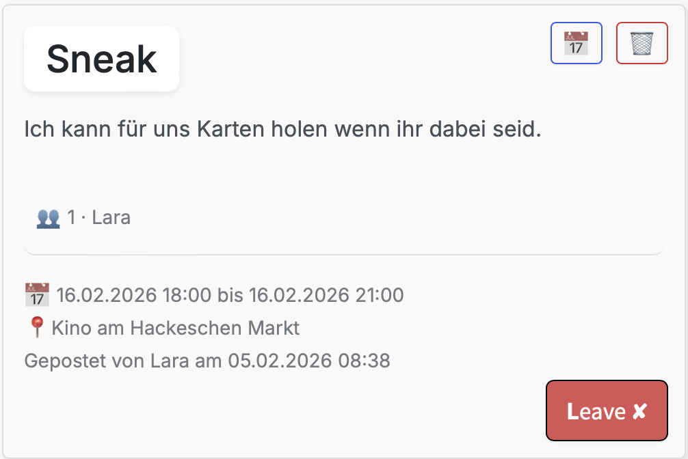

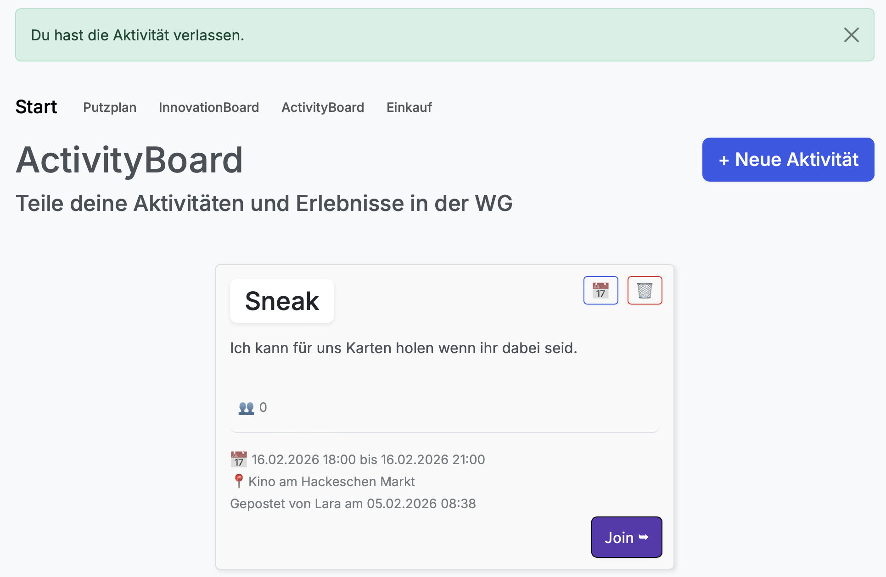

---

### `delete_activity(activity_id)`

**Route:** `/activity/<int:activity_id>/delete_activity`

**Methods:** `POST`

**Purpose:** Löscht eine Aktivität. Nur der Ersteller der Aktivität darf diese löschen.

**Sample output:** 

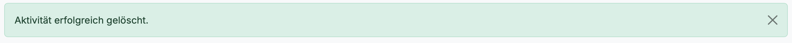

---

### `einkaufsplan()`

**Route:** `/einkaufsplan/`

**Methods:** `GET`, `POST`

**Purpose:** Zeigt die Einkaufsliste der WG an und ermöglicht das Hinzufügen neuer Artikel. Neue Artikel werden automatisch einem zufälligen WG-Mitglied zugewiesen.

**Sample output:** 

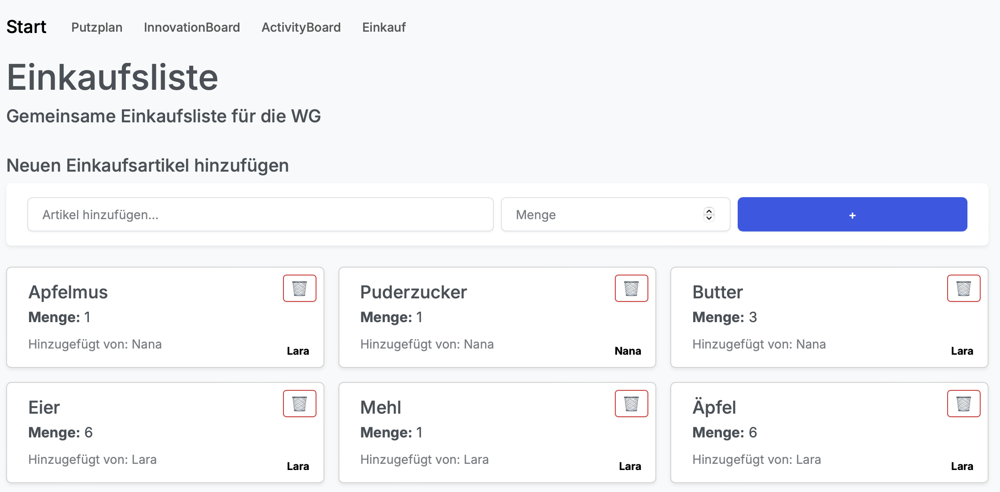

---

### `delete_shopping_item(item_id)`

**Route:** `/einkaufsplan/item/<int:item_id>/delete`

**Methods:** `POST`

**Purpose:** Löscht einen Eintrag aus der Einkaufsliste

**Sample output:** 

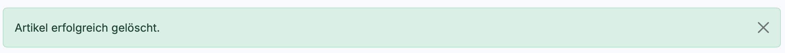

---

## Export & Kalender

---

### `activity_ics(activity_id)`

**Route:** `/activities/<int:activity_id>/ics`

**Methods:** `POST`

**Purpose:** Erstellt eine ICS-Datei für eine Aktivität, die in einen externen Kalender (z.B. Google Calendar) importiert werden kann.

**Sample output:** Download einer `.ics`-Datei.

---

### `export_wg_json()`

**Route:** `/export/wg.json`

**Methods:** `GET`

**Purpose:** Exportiert alle relevanten WG-Daten (User, Aktivitäten, Ideen, Einkaufen, Putzaufgaben) als JSON-Datei.

**Sample output:** 

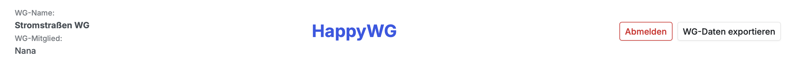

---

## Hilfsfunktionen (ohne Route)

---

### `google_calendar_url(...)`

**Purpose:** Erstellt eine Google-Calendar-URL für eine Aktivität mit Titel, Datum, Beschreibung und Ort.

**Sample output:** URL-String für Google Calendar.

---

### `build_ics(...)`

**Purpose:** Erstellt den Inhalt einer ICS-Kalenderdatei für den Export von Aktivitäten.

**Sample output:** Text im ICS-Format.

{: .fs-2 }
Last build: {{ site.time | date: '%d %b %Y, %R%:z' }}

[def]: assets/images/innoboard/deleteideareference.png